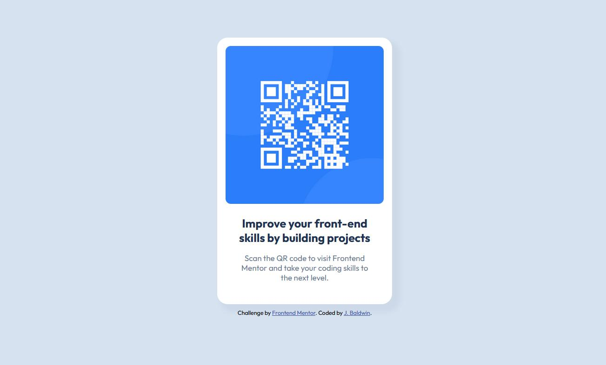

# Frontend Mentor - QR code component solution

This is a solution to the [QR code component challenge on Frontend Mentor](https://www.frontendmentor.io/challenges/qr-code-component-iux_sIO_H). Frontend Mentor challenges help you improve your coding skills by building realistic projects. 

The challenge was to construct a QR code component based on an example image and Figma design file and get it looking as close to the design as possible.

## Overview

### Screenshot

### Links
- Solution URL: [QR Code Component code](./1-qr-code-component)
- Live Site URL: [QR Code Component live](https://jmb-oddbook.github.io/1-qr-code-component/)

## My process
On the design previews I roughed in how I would segment the contents of the page into divs, headers, and other text elements. Then I continued building from the outside in, or from general to specific.

### What I learned
There are many more options to style then there were a few years ago :wink:

### Continued development
I need to look into when to use which units for font-size as well as when to use the viewport size as a unit. Also I used grid for the css layout and want to create an equivalent flex layout fpr practice.

